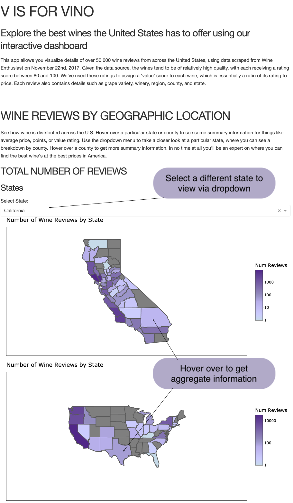
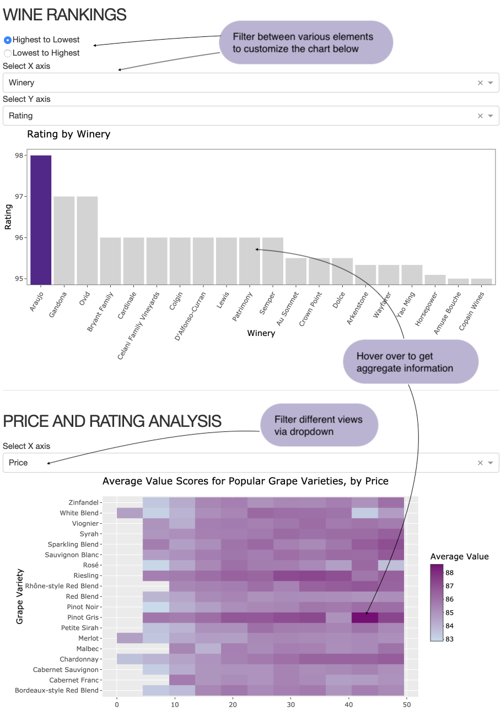

# DSCI532_Group204_R

## Dash App: Milestone 4

Due to our use of the `sf` library, we were unable to deploy our app to heroku. Refer to [this bug issue on github](https://github.com/UBC-MDS/DSCI532_Group204_R/issues/32) for details. 

To run the application locally, navigate to the root of the cloned repository and execute `Rscript app.r`
 - Note to install the required packages, you can execute our `init.R` file which will install the required files

### Summary of App Functionality

This app allows users to visualize details of over 50,000 wine reviews from across the United States, using data scraped from Wine Enthusiast on November 22nd, 2017. Given the data source, the wines tend to be of relatively high quality, with each receiving a rating score between 80 and 100. We’ve used these ratings to assign a ‘value’ score to each wine, which is essentially a ratio of its rating to price. Each review also contains details such as grape variety, winery, region, county, and state.

The ‘Geographic Analysis’ section shows how wine is distributed across the U.S., both at a national level and state by state. 
- A user can hover over a particular state to see things like average price, rating, or value. 
- A dropdown menu then allows users to take a closer look at a particular state they're interested in, where hovering on that map allows them to see similar summary information for each county.

The ‘Wine Feature Comparisons’ section allows users to explore the price, rating and value for different wineries, grape varieties, and regions. 

- The bar chart shows dynamically ranked results for calculated averages. Dropdowns allow the user to select which data to display on each axis, a slider is provided to select how many bars to display, and there is a radio button selection to choose to rank the bars in either ascending or descending order. 
- The heat map shows the distribution of value (our calculated ratio of rating to price) for popular grape varieties across either price or rating ranges, depending on the user's dropdown selection.

#### Geographic View - Choropleth Maps

 

#### Wine Features - Barchart & Heatmap

